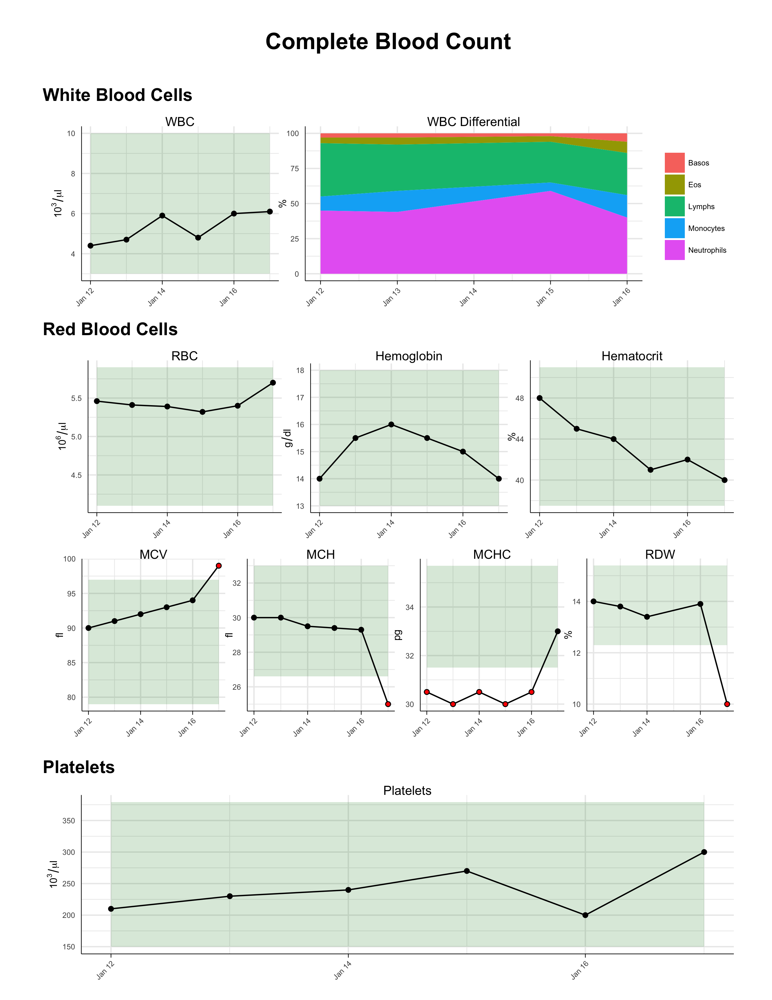
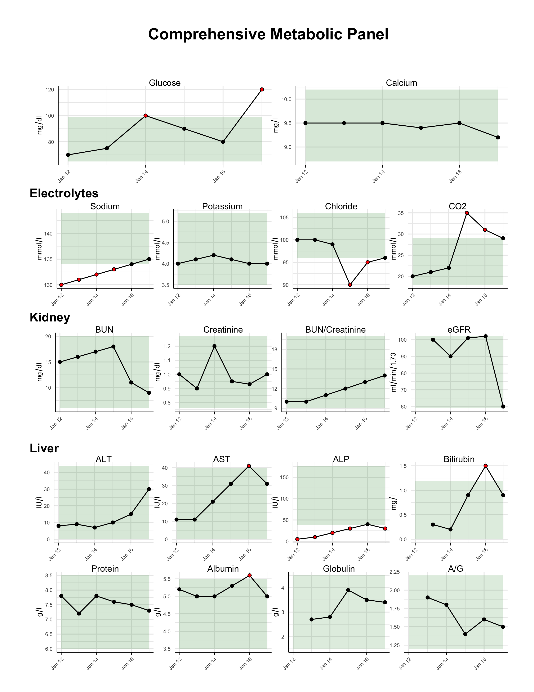
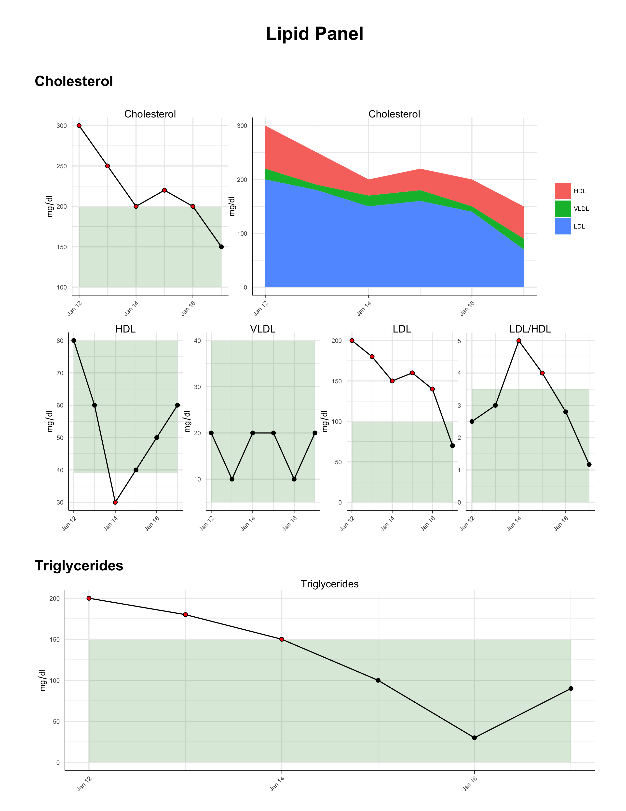

Introspect
==========

**introspect** visualizes your body internals over time, enabling to discover
trends and take action early.

The following types of lab data are supported:

1. [Complete Blood Count (CBC)](https://en.wikipedia.org/wiki/Complete_blood_count)
2. [Comprehensive Metabolic Panel (CMP)](https://en.wikipedia.org/wiki/Comprehensive_metabolic_panel)
3. [Lipid Panel](https://en.wikipedia.org/wiki/Lipid_profile)

Usage
=====

In order to produce output grpahs, **introspect** needs its data in a specific
format. Have a look into the [examples](examples) directory that contains
artificial samples for each data type.

After having entered your input data (e.g., in directory `input`), you can
now generate the plots:

    ./introspect -i input

You can now find a set of PDFs in the directory `output` for which input data
existsed.

See `./introspect -h` for more customization options, such as changing the
input/output directories, file format, and more.

Examples
=======

The examples below represent the output from the following invocation:

    ./introspect -i examples/input -o examples/output -f png

License
=======

This code ships ships with a 3-clause BSD license.
